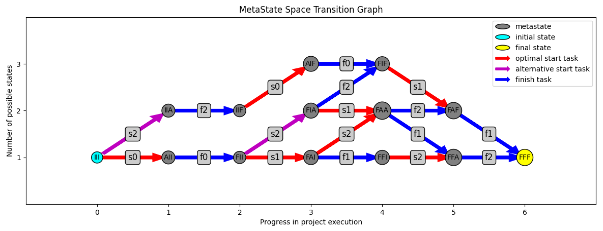
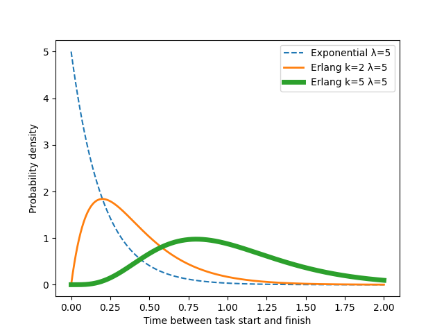
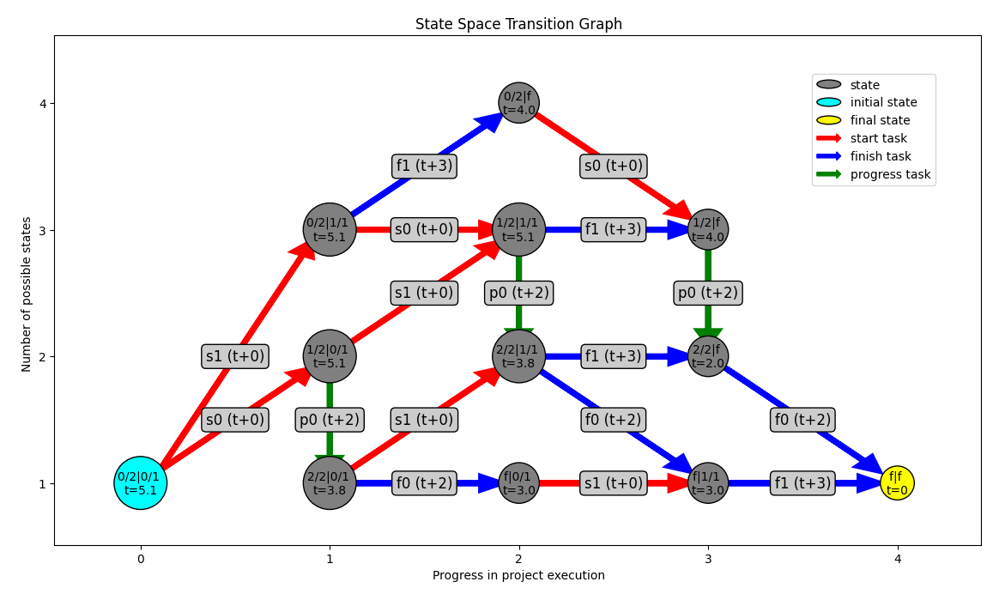

# Stochastic Resource-Constrained Project Scheduling Tools

This is a project used to explore, solve, and visualize SRCPSPs, or Stochastic Resource-Constrained Project Scheduling Problems.

### Definition

An SRCPSP is a project scheduling problem. It asks: _when to start tasks such that all are completed in the shortest time possible?_ The time between start of the first task and the completion of the last task is called the _makespan_. Some characteristics:
- Each task has a duration that is a random variable. We know its distribution.
- Each task has dependency constraints, meaning that some tasks must finish before others can start. 
- Resources are limited, each task occupies a predefined amount of each resource while active. 

On the last point: the resources are renewable, meaning the total amount of concurrent use is limited, but when a task finishes, the resources it was using become available for other tasks. If task a requires 5 units of resource 'crane', and task b requires 3 units of 'crane', then they can run simultaneously if the total available 'crane' is 8 or more. If not, they must wait for each other.

If we have a project with three tasks, (0,1, and 2), and task 1 has task 0 as a dependency, then their Gantt chart might look like:

```
Task 0:  |-----------------|
Task 1:                    |-----------------|
Task 2:  |------------------------|
----------------> time -> --------------------
```

Unless, for instance, task 0 and task 2 require the same resource, and together they require more than is available. Then we might schedule as follows:

```
Task 0:  |-----------------|
Task 1:                    |-----------------|
Task 2:                    |------------------------|
-------------------> time -> ------------------------
```

increasing the makespan. We could start with task 2, but this would be even slower, because no tasks could run simultaneously.

## Statespace Graph Framework and Memoryless tasks

I borrow heavily from the literature as produced by Cremers (1), who continued the work of Kulkarni and Adlakha (2). The seminal idea is to formulate the state space of the project as a graph, with allowed transitions between states when a particular task starts or finishes. Whether a transition is allowed, is determined by satisfying both the resource constraints and the dependency constraints.

Let us return to the example project with 3 tasks. Assume we have have 1 unit of one type of 'resource' available, and the following table holds:

| Task id | Dependencies | Resource requirements |
|---------|--------------|-----------------------|
| 0       | -            | 1                     |
| 1       | 0            | 0                     |
| 2       | -            | 1                     |

The idea is to work in terms of the graph below, made with this repo.



This framework is particularly powerful when using exponentially distributed random variables, thanks to the memoryless property. This is what we get when we model the rate of probability for a task to finish as constant in time.
For exponentials, and only exponentials, we do not need to keep track of how long a task has been running, which started first, etc. Each state is completely characterized by the set of tasks that are currently Active, Finished, or not yet started (Idle).

In the graph, the state of each task is represented by a letter, and the project states are represented by triplets of letters. Transitions are arrows indicating which task starts or finishes. The term _metastate_, in short, means the tasks may have various stages of completion collected into one node. More in the next section. 

### Erlang Distributed Tasks

With slight admin, this basic framework can be augmented to allow each task to have multiple identical stages, that must finish in sequence. Under the hood, these are separate subtasks that must start upon the completion of the previous stage. However, it is more realistic as it allows
for tasks with an Erlang duration distribution: the Erlang(k,λ) is the distribution of the sum of k exponentially distributed random variables of rate λ. Notably, an Erlang doesn't have its mode at zero. The price is, of course, added computational complexity. 

See an example of the distribution of three tasks, all with λ=5, the first consists of 1 stage, the second of 2 stages, and the last of 5 stages. Changing λ only scales the time axis. N.B. this plot can be produced using the `src/utils.py` function `plot_exponential_vs_erlang`.



The Erlang is a special case of the hypoexponential distribution, with all λs equal. Among hypoexponentials with a fixed mean, the Erlang has the smallest variance. Thus Erlang is not only simpler to describe, conversely allowing for different λs per stage is also less desirable from a modeling perspective. I have therefore not implemented the more general hypoexponential distribution.

## Execution Policies

Despite the resource requirements, and dependency requirements per task, there is still superexponential freedom in choosing the scheduling order. The most concise (but less powerful) way to encode our order preference, is with a _policy_.

A policy is simply a permutation of the task indices. I.e. for tasks (0,1,2), a policy could be [2,0,1]. Executing it means always starting the first idle task in the list that is allowed by the constraints. If no task is allowed, we wait until an active one finishes, then return to the policy. It is clear that there are n! policies for n tasks, though in execution they might not all be unique, due to constraints. 

They are also 'blind', not taking into account the history of the project. This is where the next section comes in.

### Contingent Stochastic Dynamic Programming

I have developed and coded a type of contingent Dijkstra's algorithm for the shortest traversal of the state-space graph from Project start to project finish. Let us call this technique Contingent Stochastic Dynamic Programming, or CSDP.
Executing a project in CSDP, we keep a lookup table of which tasks to start (or whether to wait), given that we find ourselves in any project state, such that the expected remaining duration is minimized. The reasoning hinges on linearity of expectations. Even if we are pushed off the expected course, because a task that should have taken long, takes only a short time, or vise versa, we can still use the lookup table to find the optimal next task to start, _contingent_ on inadvertently being in this state.

In the graph first, this is represented by the red arrows. If a state has a red arrow leaving from it, then it is time-efficient to start that task as soon as we arrive at this state. We cannot predict which of the blue arrows will be traversed a priori (i.e. from FAA, we might end up in FFA or FAF), but we can always take a red one when presented.

The astute reader will notice that we cannot perform fully the second phase of traditional Dijkstra's. This is because at many vertices, we don't control which edge we take (which task finishes first). So we can't simply distill the shortest path from the potential landscape we constructed, and throw away the rest. During traversal, we need still need it.

### Obtaining the state-space graph

A necessary precursor to navigating the state-space, is mapping it out. A priori, we could imagine any state with any combination of idle, active, and finished tasks. In technical terms, with `n` states, the `n`-ary Cartesian product of the `n` individual task state spaces forms a superset of the project state space. But of course, many of these states are infeasible, and can be discarded. Evidently:
- States are infeasible if the any of the cumulative resources required by active tasks exceed those available.
- States are infeasible if tasks are active or finished, while their dependencies are not finished.

It is not clear whether there is a non-empty set of tasks that may be feasible under these rules, but simply unreachable from the initial state. Nonetheless, our method obtains all reachable states by construction. Run the following pseudocode:

0. Add the initial state to the state space as a vertex. Make it the _current_ state. Keep track of states that have been current already.
1. With the current state, do the following:
   1. Consider which tasks can be started. This is the set of tasks
      - that are idle in the current state, 
      - and whose dependencies are all finished in current state,
      - and whose starting would not exceed the resource constraints given the tasks that are already currently active.
   2. For each of these tasks, add to the state-space the state that differs from the current state by the activation of that task. It's a vertex. Connect it to the current state by a directed (s) edge.
   3. All tasks that are active in the current state can progress or finish.
   4. For each of these tasks, add to the state-space the state that differs from the current state by the progression or finishing of that task. It's a vertex. Connect it to the current state by a directed (p) or (f) edge.
2. For each state found in steps 1.ii and 1.iv, repeat step 1 with it as the current state. If a state was current in an earlier iteration, skip it.
3. When all states added have been current through steps 1.i-1.v once, the state space is complete. Terminate.

In summary, task dependencies and resource availability determine the possible states, and the possible transitions. State-space is built recursively. The repo implements this in the module `src/StateSpace.py` with the method `StateSpace._graph_from_tasks()`. Once this graph is fully constructed, we can use it to fill out the CSDP contingency table.

### Obtaining the contingency table

This section contains, in my eyes, the most important original contribution of the repo. I will explain obtaining the contingency table with the aid of a tiny toy project. There are two tasks, no constraints, and their durations are exponential / Erlang, tabulated below:

| Task id | # Stages | Avg. time per stage | Dependencies | Resource requirements |
|---------|----------|---------------------|--------------|-----------------------|
| 0       | 2        | 2 units             | -            | 0                     |
| 1       | 1        | 3 units             | -            | 0                     |

The topology of the state-space is graphed below.



In this graph:
- The round buttons are states. Their label describes the progress of the two tasks, separated by a pipe (|). 
- The first state can be Idle (0/2), Active (1/2 or 2/2), or Finished (f). The second state can be Idle (0/1), Active (1/1), or Finished (f). 
- Beneath the states is printed the expected time-to-finish, _contingent on taking the optimal path_. 
- E.g. the expected duration of the entire project is t=5.1 units of time, as seen in the initial state in cyan. 
- The arrows between states indicate whether a task is starting (s), progressing (p), or finishing (f), and carry the expected time for that transition to take place _in isolation_.
- Starting a task is immediate.

An important note: When multiple tasks are running, due to the memoryless property, the expected time until the first one of them progresses a stage / finishes (and therefore, the state transitions) is lower than the minimum of expected times for each individual task. The exact formula follows below. 

For each state, we wish to calculate the expected time-to-finish (t) from that state. The contingency table will always point a state to the connecting next state with the lowest expected time-to-finish. 
In the code, the expected time-to-finish is calculated recursively. We call a function `StateSpace.dynamic_step(initial_state)`, which returns t. It, in turn, will query `dynamic_step` on all the states the initial state can evolve into, etc. Thus the algorithm spreads out to all the reachable state space. Once a definite expected-time-to-finish is returned for a state, because all its constituents are known, it is stored using memoization, to avoid duplicate calculations.
However, the easiest way to explain the logic, is the opposite of the way it is coded. We will work our way _up_ the call stack, after the deepest level of recursion has been invoked. 

Namely, for the final state, the expected time-to-finish is trivially 0. See the yellow button in the graph above.

Then, from states that directly evolve into that state (in this case, only through task-finishing transitions), it is also clear that the expected remaining duration is the expected stage duration for the active task. Therefore, the two gray buttons connecting to end state have expected time-to-finish t=2 and t=3, respectively.

Now it gets more interesting. What happens when a state can evolve in multiple directions? In this case, we distinguish two competing transition types: 
1. starting a task: the fastest start option
2. waiting for a task to finish: the wait option.

Let "S;c" be the state S, where task c has been evolved: if it was idle, now it is active, if it was active, it has progressed or finished if it was in its last stage.
From state S, let there be idle tasks (a_1, a_2, ... a_m) that could be started individually, and tasks (b_1, b_2, ... b_n) that are active already. We collect the expected time-to-finish, contingent on starting any of the tasks, or waiting for an (unknown) task to finish. The time-to-finish of state S is the minimum of those options:

    t(S) = min{ t(S| start a_1), t(S| start a_2), ... t(S| start a_m), t(S| wait) }

What is the expected time-to-finish, after starting a task a_1? Because starting a task is immediate, it is simply the expected time-to-finish of the states obtained by starting a_1. The recursion will call that value, and eventually return it.

    t(S| start a_1) = t(S;a_1)

What is the expected time-to-finish, contingent on taking the wait option? If there is only one active task (n=1), it's the expected duration of that (stage of) the task, plus the time-to-finish of the resultant state.

    t(S| wait) = E[task b_1] + t(S;b_1) = 1/λ_b_1 + t(S;b_1)

If there are no active tasks (n=0), t(S| wait) is infinite.

If n>1, the general case, is quite elegant. The λ parameter in an exponential distribution is the rate at which a Poisson process occurs. If multiple Poisson processes are running, the rate at which the first one finishes is the sum of the rates of the individual processes. Thus, the expected time until transition is the average of an exponential distribution with _composite_ λ equal to the sum of the λs of tasks b_1, b_2, ... b_n: 

    E[tasks b_1, b_2, ... b_n] = 1/(λ_b_1 + λ_b_2 + ... + λ_b_n).

After the first task finishes, we must add the expected time to finish of the resultant state. This is the linear probabilistic superposition of the expected times of the possible outcomes (each task could have finished), weighted by their probability. The weights are, of course, commensurate with the rates as well.

    t(S| wait) = (1 + λ_b_1 * t(S;b_1) + λ_b_2 * t(S;b_2) + ... + λ_b_n * t(S;b_n) ) / (λ_b_1 + λ_b_2 + ... + λ_b_n)

So, at each node, the recursive algorithm takes the set of tasks that can start, progress, or finish from the state space (see the previous section), and calls the `dynamic_step` function on each of them. It calculates the composite exponential (if applicable), and set the time-to-finish of the state as the minimum of the options. In the contingency table, we store what option that was.

This example produces the Contingency table:

| State | t   | optimal transition |
|-------|-----|--------------------|
| ff    | 0.0 | -                  |
| f1    | 3.0 | wait               |
| 2f    | 2.0 | wait               |
| 1f    | 4.0 | wait               |
| 0f    | 4.0 | s0                 |
| 11    | 5.1 | wait               |
| 21    | 3.8 | wait               |
| f0    | 3.0 | s1                 |
| 01    | 5.1 | s0                 |
| 10    | 5.1 | s1                 |
| 20    | 3.8 | s1                 |
 | 00    | 5.1 | s0                 |


N.B. in the code, whenever a distribution is queried for its expectation, instead we take a quantile, this quantile is set globally for all tasks. Formally, this is, of course, nonsense, because there is no linearity of quantiles property in statistics. But it allows for more freedom to run a heuristic algorithm of the same shape in 'optimistic' or 'worst-case-scenario' planning mode, by setting it to a high or low quantile.
Moreover, for exponential distributions, there is a specific quantile that coincides with the expectation: 1-1/e. It is independent of the rate parameter λ. This is the default value, and by choosing it, we recover exactly the math from above.

Now that the theory is explained: how should one use these tools? On to the next section.

## Getting Started

If you would simply like to play around with the repo out of the box, I suggest you install the `requirements.txt` file, and run `main.py`. It contains examples of the classes and how to interact with them, along with some comments.

The basic flow of this repo is:

1. Create a number of `Task` objects, with dependencies and resource requirements, and put them in a `Project` object.
2. Visualize the `StateSpace` graph of the project, and understand the choices that can be made in execution.
3. Formulate any number of static policies (`Policy`), and see their performance on the project.
4. Use the CSDP to find the dynamic policy, in terms of the contingency table.
5. Compare the performance of the dynamic policy to the static policies in an `Experiment` with a large number of (stochastich) simulations of the project.

## Modules in this Repo

The main modules in `src` are:

- `Project.py`
- `Policy.py`
- `StateSpace.py`

and less fundamental:
- `Experiment.py`,

which all borrow from the `Objects.py` classes:

- `Task`
- `Resource`
- `ProbabilityDistribution`.

Let's start with the objects.

## Objects.py

### Task

The Task class is the most fundamental object of this repo, of which a project consists. It has the following parameters upon initialization:

- `.__init__()`:
  - Usage:
    - conventional way to initialize a Task object.
  - Arguments:
    - `task_id`: an integer, the unique identifier of the task.
    - `resource_requirements`: a dictionary of `Resource` objects mapping to the integer amount of each required.
    - `duration_distribution`: a `ProbabilityDistribution` object, representing the stochastic duration of the task.
    - `dependencies`: a list of integers, the `task_id`s of the tasks that must finish before this task can start.
    - `stages`: an integer, the number of stages this task consists of. Default is 1.
  - Returns:
    - The initialized Task object.

The `Task` instance has the following methods:

- `.__repr__()`:
  - Usage:
    - What you get when you `print(task)` after `task = Task(...)`.
    - Show all the input params, the distribution, and the minimal dependencies
  - Arguments:
    - None.
  - Returns: 
    - a string representation of the Task object.
- `.duration_realization()`:
  - Usage: 
    - Sample the distribution of the task and return a value with probability according to the distribution.
    - This also progresses the task to the next stage. If there is only one stage, the task is then finished.
  - Arguments:
    - None.
  - Returns:
   - A float or int, depending on the particular implementation of the attached distribution. The value is a realization of the duration distribution.
- `.enough_resources()`:
  - Usage:
    - Check if the task can be executed with the available resources.
  - Arguments:
    - `resources_available`: a dictionary of `Resource` objects mapping to the integer amount of each available.
  - Returns:
    - A boolean, True if the task can be executed with the available resources, False otherwise.
- `.stage_quantile_duration()`:
  - Usage:
    - Return the p-quantile of the distribution of the task.
  - Arguments:
    - `p`: a float, the quantile to return.
  - Returns:
    - A float, the p-quantile of the distribution of the task.

The `Task` instance has the following properties:

- `.average_duration`: float, the average duration of the distribution of the task.
- `.minimal_duration`: int or float, the minimal duration of the distribution of the task. 
- `.maximal_duration`: int or float, the maximal duration of the distribution of the task. If continuous, this is infinity.

There are two class methods, as alternative ways to instantiate a Task object, i.e. `task = Task.generate_random(...)`.

- `.generate_random()`:
  - Usage:
    - Generate a task with random resource requirements and duration.
  - Arguments:
    - `task_id`: integer denoting the task ids
    - `dependencies`: list of task ids that this task depends on (must be done before)
    - `max_dependencies`: maximum number of dependencies randomly chosen
    - `resource_types`: number of resource types or list of resource types
    - `max_simultaneous_resources_required`: maximum number of resources required
    - `duration_average_range`: range of average duration
    - `duration_variance_range`: range of variance of duration
    - `prob_type`: type of probability distribution for duration, can be "uniform", "binomial", "random", "exponential", "erlang". For the latter 2, uses an `ExponentialDistribution` object. For the former three, uses an `IntProbabilityDistribution` object with various probability protocols.
    - `max_stages`: maximum number of stages for any task
  - Returns:
    - A Task object.
- `.from_dict()`:
  - Usage:
    - Create a task from a config dictionary.
  - Arguments:
    - `task_dict`: a dictionary with the following keys: `id`, `resource_requirements`, `distribution`, `dependencies`, `stages`.
  - Returns:
    - A Task object.

### Resource

The Resource class is a simple `Enum` that enumerates the resources that can be required by tasks. It has the following members:
- `Resource.centrifuge`
- `Resource.crane`
- `Resource.drill`

One can easily modify the repo to allow for more resource types, or change the names, but care must be taken to then also modify the `config.py` file.

### ProbabilityDistribution

This is a `ABC` parent class, of which two children are currently implemented that inherit from it, `IntProbabilityDistribution` and `FloatProbabilityDistribution`. The `IntProbabilityDistribution` is used for tasks that have integer durations, and the `ExponentialDistribution`. All distributions have the following methods:

- `.realization()`: 
  - Usage:
    - Sample the distribution and return a realization.
  - Arguments:
    - None.
  - Returns:
    - A float or int, depending on the particular implementation of the distribution. The value is a realization of the distribution.
- `.quantile()`:
  - Usage:
    - Return the p-quantile of the distribution.
  - Arguments:
    - `p`: a float, the quantile to return.
  - Returns:
    - A float or int, depending on the particular implementation of the distribution. The value is the p-quantile of the distribution.

They also have the following properties:
- `.average`: float, the average duration of the distribution.
- `.max`: float or int, the maximal duration (worst case scenario) of the distribution. For continuous distributions, this is infinity or a very high quantile, as set in the `config.py` file.

### IntProbabilityDistribution

This is a child class of `ProbabilityDistribution` that is used for tasks that have integer durations. It is characterized by the values and their discrete finite probabilities.
Most of the repo will not work with this type, because it is not memoryless (as evinced by the method `prob_finish_at()`), but it is still useful for some simulations and as a comparison to the exponential distribution.

- `.__init__()`:
  - Usage:
    - Initialize an IntProbabilityDistribution object.
  - Arguments:
    - `values`: a list of integers, the possible values of the distribution.
    - `probabilities`: a list of floats, the probabilities of the corresponding values.
  - Returns:
    - The initialized IntProbabilityDistribution object.
- `.prob_finish_at()`:
  - Usage:
    - Return the probability of finishing at time, given that it did not finish at any earlier time. If queried on a time-step that is not in the support, return 0.
    - For example, if we have arrived on the last value of its support, and the task has not finished yet, the probability of finishing at this time is 1.
    - Useful for timestep simulations.
  - Arguments:
    - `time`: an integer, the time-step to query. If, for instance `time`=4, we get the probability of finishing at time 4, given that the task has not finished at time 3 or earlier.
  - Returns:
    - A float, the probability of finishing at time `time`.

### ExponentialDistribution

The central distribution of this repo. Used for exponentially distributed tasks, and also Erlang, as it will simply be sampled multiple times.

- `.__init__()`:
  - Usage:
    - Initialize an ExponentialDistribution object.
  - Arguments:
    - `lambda`: a float, the rate parameter of the distribution.
  - Returns:
    - The initialized ExponentialDistribution object.

## Project.py

The `Project` class is the main bookkeeping object of the repo. It collects all the moving parts needed to describe an idealized scheduling project.

The `Policy`, `DynamicPolicy`, and `Experiment` classes are created to interact with the `Project` class. It in turn leverages the `StateSpace` and `Task` classes.

### Project

An instance of the `Project` class has the following methods.

- `.__init__()`:
  - Usage:
    - Initialize a Project object.
    - Will prune the dependencies of the individual tasks, to achieve the minimal set per task that is equivalent to the input. I.e. if task 2 requires [0,1], but task 1 requires [0], then task 2 need only require [1].
    - Will also immediately construct the `StateSpace` object, and the `contingency_table` needed to execute the CSDP.
  - Arguments:
    - `task_list`: a list of `Task` objects, the tasks of the project.
    - `resource_capacities`: a dictionary with `Resource` objects as keys and integers as values, the capacities of the resources.
    - `decision_quantile`: a float, the quantile to use for decision-making in the CSDP. Default is 1-1/e, which turns the quantile into the expectation for exponential distributions.
  - Returns:
    - The initialized Project object.
- `.visualize_state_space()`:
  - Usage:
    - Visualize and plot the graph structure of the corresponding `StateSpace` object of this project.
  - Arguments:
    - `metastate_mode`: a boolean, if True, group states into `MetaState` objects, which are sets of states with the same active tasks. If False, show states with tasks in different stages of completion as separate nodes. Very quickly becomes too convoluted.
    - `rich_annotations`: a boolean, if True, show the task ids that start (s), progress (p) or finish (f) between states as annotations on the edges. Also show in the nodes the status of each task of the project. If False, only show the number of states per `MetaState`.
  - Returns:
    - None.
- `__repr__()`:
  - Usage:
    - What you get when you `print(project)` after `project = Project(...)`.
    - Shows a table with the attributes of the tasks, then the available resources, duration statistics, and some information about the state-space complexity.
  - Arguments:
    - None.
  - Returns:
    - a string representation of the Project object.
- `.reset_task_stages()`:
  - Usage:
    - Reset the stages of all tasks to 0. When tasks are queried for duration realizations, they count through stages. When simulating a project repeatedly, these must be reset.
  - Arguments:
    - None.
  - Returns:
    - The same `Project` object with all tasks reset to stage 0.
- `prune_dependencies()`:
  - Usage:
    - A `Task` instance may have an arbitrary set of its own dependencies, in isolation. In the context of other tasks in the project, these may be redundant.
    - This method remove dependencies from tasks that are already dependencies of dependencies. 
    - It modifies the internal parameter `minimal_dependencies` of the `Task` objects in this project.
    - Also fills the `full_dependencies` attributes of the `Task` objects, including all dependencies of dependencies.
  - Arguments:
    - None.
  - Returns:
    - None.
- `.print_contingency_table()`:
  - Usage:
    - Print the contingency table of the project in a concise way.
    - Each row is a set of states at which a particular task should be started.
    - Not all states are represented, only the ones where a task should be started according to the CSDP.
  - Arguments:
    - None.
  - Returns:
    - None.

The class has the class method `from_config()` that allows for easy instantiation of a `Project` object from a `Config` object.

- `.from_config()`:
  - Usage:
    - Create a project from a configuration object. If the configuration is a `RandomConfig`, the tasks will be generated randomly. If it is a `LiteralConfig`, the tasks will be created to the specifications in the configuration.
  - Arguments:
    - `config`: a `Config` object, either a `RandomConfig` or a `LiteralConfig`. For the syntax, there are examples in the `config.py` file, and the `Task` class.
  - Returns:
    - A `Project` object.

The `Project` instance has the following properties:

- `.max_time`: int, the maximum time it would take to complete all tasks in sequence, for the 0.999 quantile of the duration distributions. Useful for setting simulation horizons.
- `.n_topological_orderings`: int, the number of distinct orders in which the tasks can be carried out, considering only dependencies (not resource constraints). A proxy for the complexity of the project.

## Policy.py

This module contains two classes, `Policy` and `DynamicPolicy`, that are used to interact with the `Project` class. They are used to determine the timing of execution of tasks in the project.

### Policy

The `Policy` class implements the classic functionality of a project scheduling policy. It has the following methods.


## Sources
```
1: Cremers, S. (2015): Minimizing the expected makespan of a project with stochastic activity durations under resource constraints
2: Kulkarni, V., & Adlakha, V. (1986): Markov and Markov-regenerative PERT networks
```
